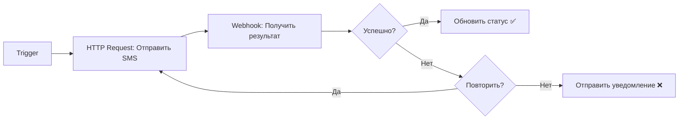

# 🎯 Интеграция SMS-автоматизации с N8N

Этот проект автоматически отправляет SMS через OpenPhone и **отправляет callback в N8N** после каждой отправки.

## 📊 Как это работает

```
┌─────────┐      ┌──────────────┐      ┌───────────┐      ┌─────────┐
│   N8N   │─────▶│   Webhook    │─────▶│   Queue   │─────▶│OpenPhone│
│(входной)│      │(/webhook/send)│      │  Service  │      │ Browser │
└─────────┘      └──────────────┘      └───────────┘      └─────────┘
                                              │
                                              ▼
                                        ┌──────────┐
                                        │ Supabase │
                                        │   (лог)  │
                                        └──────────┘
                                              │
                                              ▼
                                        ┌──────────┐
                                        │   N8N    │◀───── ✅ CALLBACK
                                        │ Webhook  │
                                        └──────────┘
```

## 🔗 Настройка N8N Webhook Callback

### 1. Создайте Webhook в N8N

В вашем N8N workflow:

1. Добавьте узел **Webhook**
2. Установите **HTTP Method**: `POST`
3. Скопируйте **Production URL** (или Test URL)

Пример URL:
```
https://wheelsfeels.app.n8n.cloud/webhook-test/4064282f-1891-481b-b116-68b4523f5c30
```

### 2. Настройте `.env` файл

Добавьте URL webhook в файл `.env`:

```bash
N8N_WEBHOOK_URL=https://wheelsfeels.app.n8n.cloud/webhook-test/4064282f-1891-481b-b116-68b4523f5c30
```

### 3. Перезапустите сервис

```bash
# Локально
npm run build
npm start

# В Docker
docker-compose down
docker-compose up -d --build
```

## 📦 Формат данных Callback

После каждого SMS сервис отправит POST запрос в N8N со следующими данными:

### ✅ Успешная отправка

```json
{
  "success": true,
  "status": "sent",
  "phone": "+1234567890",
  "external_id": "your_custom_id",
  "timestamp": "2026-01-17T10:30:45.123Z",
  "attempt": 1,
  "duration_ms": 15234
}
```

### ❌ Неудачная отправка

```json
{
  "success": false,
  "status": "failed",
  "phone": "+1234567890",
  "external_id": "your_custom_id",
  "timestamp": "2026-01-17T10:30:45.123Z",
  "attempt": 3,
  "duration_ms": 12500,
  "error": {
    "code": "TIMEOUT",
    "message": "Navigation timeout"
  },
  "screenshot_url": "screenshots/error-1737108645123-1234567890.png"
}
```

### 🔄 Повторная попытка

```json
{
  "success": false,
  "status": "retrying",
  "phone": "+1234567890",
  "external_id": "your_custom_id",
  "timestamp": "2026-01-17T10:30:45.123Z",
  "attempt": 1,
  "duration_ms": 8500,
  "error": {
    "code": "NETWORK_ERROR",
    "message": "Connection timeout"
  }
}
```

## 🎨 Пример N8N Workflow

### Шаг 1: Отправка SMS (HTTP Request)

```
POST http://localhost:3000/webhook/send
Content-Type: application/json

{
  "phone": "+1234567890",
  "text": "Привет! Это тестовое сообщение",
  "external_id": "order_12345"
}
```

### Шаг 2: Получение Callback (Webhook)

N8N автоматически получит callback с результатом:

```javascript
// В N8N можете использовать эти данные:
const success = $json.success;
const status = $json.status;
const phone = $json.phone;
const externalId = $json.external_id;

if (success) {
  console.log(`✅ SMS отправлен на ${phone}`);
} else {
  console.log(`❌ Ошибка: ${$json.error.message}`);
}
```

### Шаг 3: Обработка результата

Вы можете:
- ✅ Обновить статус в базе данных
- ✅ Отправить уведомление
- ✅ Запустить следующий workflow
- ✅ Логировать ошибки
- ✅ Повторить попытку (если нужно)

## 🔍 Статусы сообщений

| Статус | Описание |
|--------|----------|
| `sending` | Сообщение отправляется |
| `sent` | ✅ Успешно отправлено |
| `failed` | ❌ Не удалось отправить |
| `retrying` | 🔄 Повторная попытка |

## 🛠️ Отладка

### Проверка webhook

```bash
curl -X POST https://wheelsfeels.app.n8n.cloud/webhook-test/4064282f-1891-481b-b116-68b4523f5c30 \
  -H "Content-Type: application/json" \
  -d '{"test": "data"}'
```

### Логи

Все callback логируются:
```
2026-01-17 10:30:45 [info] : Sending callback to N8N for +***90 (status: sent)
2026-01-17 10:30:45 [info] : ✅ N8N callback sent successfully for +***90
```

Если callback отключен:
```
2026-01-17 10:30:45 [debug] : N8N webhook disabled, skipping callback
```

### Частые проблемы

1. **Callback не приходит**
   - Проверьте `N8N_WEBHOOK_URL` в `.env`
   - Убедитесь, что webhook в N8N активирован (Production mode)
   - Проверьте логи: `tail -f logs/combined.log`

2. **Ошибка "Webhook returned 404"**
   - URL webhook неверный или webhook был удален
   - Создайте новый webhook в N8N

3. **Timeout при отправке callback**
   - Проблемы с сетью или N8N недоступен
   - Callback не останавливает отправку SMS (fail-safe)

## 📊 Пример полного workflow в N8N



## 🚀 Production готовность

- ✅ Автоматические retry при ошибках сети
- ✅ Fail-safe: ошибки callback не останавливают SMS
- ✅ Подробное логирование
- ✅ Скриншоты при ошибках
- ✅ Сохранение в Supabase + отправка в N8N

---

**Готово!** Теперь каждое отправленное SMS автоматически отправляет данные в ваш N8N workflow! 🎉
